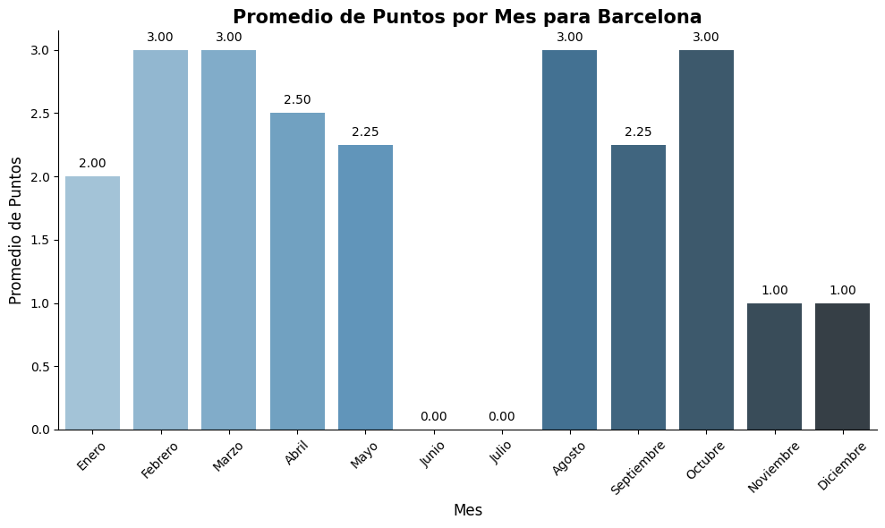
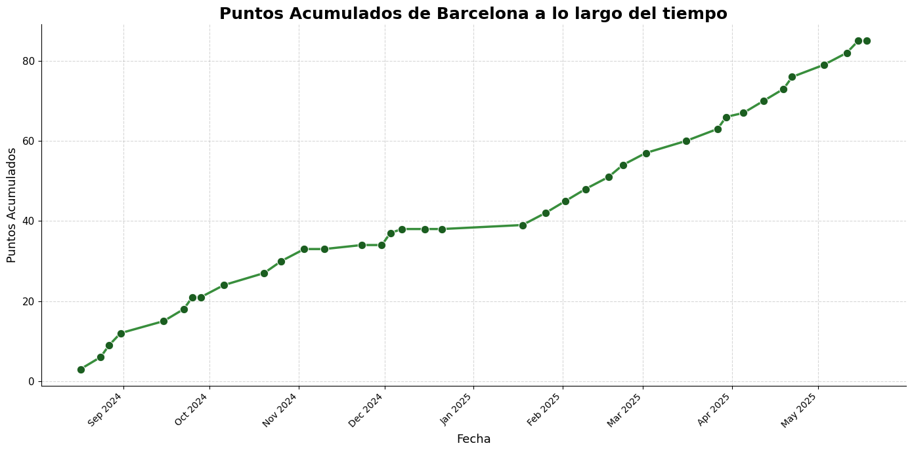
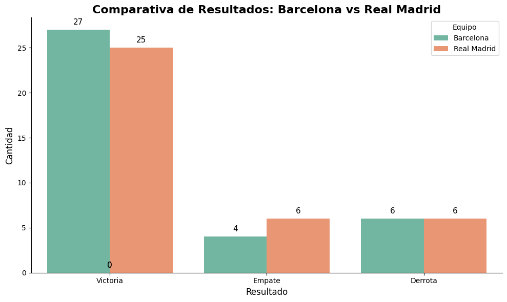
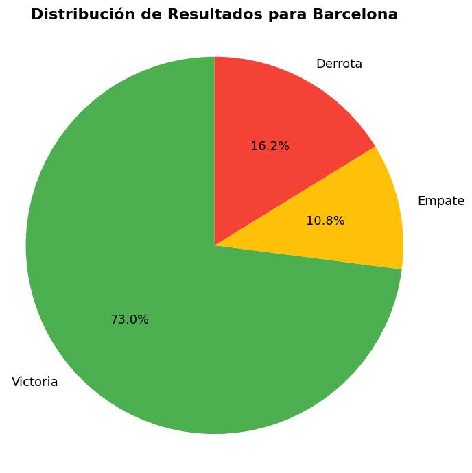

# ⚽️ Analizador de Resultados de Fútbol 📊

Este proyecto permite analizar y comparar el rendimiento de equipos de fútbol a partir de archivos CSV de resultados históricos. Incluye funciones para filtrar partidos, calcular puntos, obtener promedios mensuales y comparar equipos de forma gráfica e interactiva.

---
## ✨ Características

- 📥 **Carga y validación** de archivos CSV de resultados.
- 📅 **Procesamiento y enriquecimiento** de fechas.
- 🔎 **Filtrado** de partidos por equipo.
- 🏆 **Cálculo de puntos** obtenidos por partido.
- 📈 **Promedio de puntos** por mes.
- 📊 **Gráficas** de evolución y distribución de resultados.
- ⚔️ **Comparación visual** entre dos equipos (barras y gráficos circulares).
- 💾 **Exportación** de resultados procesados a CSV.

---
## 🖼️ Ejemplos de Gráficas

- ### Promedio de puntos por mes


---
- ### Puntos acumulados a lo largo del tiempo


---
- ### Comparativa de resultados entre equipos


---
- ### Distribución de resultados para un equipo


---
## 🛠️ Requisitos

Instala las dependencias con:

```python
pip install -r requirements.txt
```

---
## 🚀 Uso

**1.** 📂 Coloca tu archivo **CSV** de resultados en la carpeta **`data/`** (por ejemplo, **`SP1.csv`**).
**2.** 📝 Abre y ejecuta el notebook **`analisis.ipynb`**.
**3.** ⚙️ Modifica los nombres de los equipos en las funciones para analizar o comparar los que desees.

---
## 🆚 Ejemplo de comparación
- Utiliza esta función para comparar los resultados de dos equipos específicos. Cambia los nombres de los equipos según tus necesidades.

```python
comparar_resultados_equipos(df_original, "Barcelona", "Real Madrid")
```

---
## 📁 Estructura recomendada

```
.
├── analisis.ipynb
├── data/
│   └── SP1.csv
├── img/
│   ├── promedio_puntos_mes.png
│   ├── puntos_acumulados.png
│   ├── comparativa_resultados.png
│   └── distribucion_resultados.png
├── requirements.txt
└── README.md
```

---
## 🤝 Contribuciones

¡Las contribuciones son bienvenidas! Por favor, sigue estos pasos:

1. 🍴 Haz un fork del proyecto y crea una nueva rama:
    - `git checkout -b feature/nueva-funcionalidad`
2. 💻 Realiza tus cambios y haz commit:
    - `git commit -am 'Agrega nueva funcionalidad'`
3. 🚀 Sube los cambios:
    - `git push origin feature/nueva-funcionalidad`
4. 🔀 Abre un Pull Request.

---
## 📜 Licencia

Este proyecto está licenciado bajo la Licencia **MIT**.

---
## 📬 Contacto
- **Autor:** **Miguel Ángel Sarmiento Levy**
- 📧 **Email**: [](mailto:msarmientolevy@gmail.com)
- 💼 **LinkedIn**: [](https://www.linkedin.com/in/miguel-sarmiento-levy)
- 🗂️ **Enlace del Proyecto**: [](https://github.com/miguelASL/Barcelona-FC)

---
